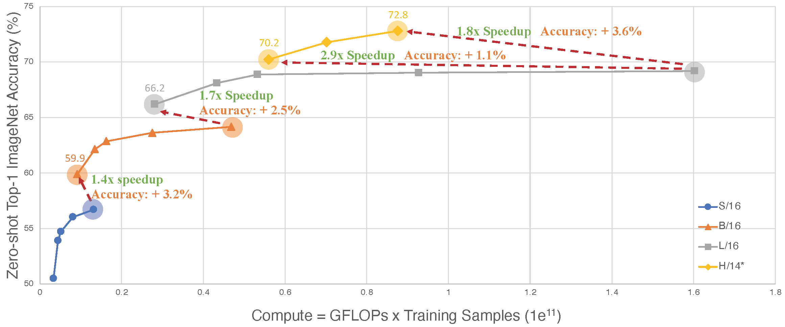

# An Inverse Scaling Law for CLIP Training
This is a PyTorch/PyTorch-XLA implementation of the paper  [An Inverse Scaling Law for CLIP Training]().
It can run on both GPU or TPU devices (see [TRAIN](https://github.com/UCSC-VLAA/RobustCNN/blob/main/TRAIN.md)/[TEST](https://github.com/UCSC-VLAA/RobustCNN/blob/main/TEST.md) instructions).
Our implementation is heavily based on the [OpenCLIP](https://github.com/mlfoundations/open_clip).


## Introduction
CLIP, the first foundation model that connects images and text, has enabled many recent breakthroughs in computer vision. 
However, its associated training cost is prohibitively high, imposing a significant barrier to its widespread exploration. 
In this paper, we present a surprising finding that there exists an _inverse_ scaling law for CLIP training, 
whereby the larger the image/text encoders used, the shorter the sequence length of image/text tokens that can be applied in training. 
Moreover, we showcase that the strategy for reducing image/text token length plays a crucial role in determining the quality of this scaling law.

As a result of this finding, we are able to successfully train CLIP even by using academic resources. 
For example, on an A100 eight-GPU server, our CLIP models achieve zero-shot top-1 ImageNet accuracies of **63.2%** in about **2 days**, 
**67.8%** in about **3 days**, and **69.3%** in about **4 days**. 
By reducing the computation barrier associated with CLIP, we hope to inspire more research in this field, particularly from academics.

<div align="center">
  
</div>


## Installation
A simple 
```
pip install -r requirements.txt
```
is enough.

Note that this repo is compatible with both GPU and TPU. If you want to run the code on Google Cloud TPU, here are some documents you may find helpful:
[Google Cloud User's Guide](https://cloud.google.com/tpu/docs/pytorch-xla-ug-tpu-vm) and [TIMM bits README](https://github.com/rwightman/pytorch-image-models/blob/bits_and_tpu/timm/bits/README.md)


## Data preparation

### LAION400M
You can download the LAION400M dataset using the handy [img2dataset](https://github.com/rom1504/img2dataset) tool. 
It supports both `webdataset` and `tfrecord` format. 

To run this code on Google Cloud, we strongly recommend `tfrecord` over `webdataset`.
Since LAION400M is not a TFDS officially supported dataset, we provide some custom scripts for post-processing the downloaded tfrecord files [here]().

### ImageNet-1K
Download and extract ImageNet train and val images from http://image-net.org/.
The directory structure is the [standard layout](https://pytorch.org/docs/stable/torchvision/datasets.html#imagefolder) for the torchvision, and the training and validation data is expected to be in the `train` folder and `val` folder respectively:

```
/path/to/imagenet/
  train/
    class1/
      img1.jpeg
    class2/
      img2.jpeg
  val/
    class1/
      img3.jpeg
    class/2
      img4.jpeg
```

We also support reading ImageNet-1K in the `tfrecord` format. 
Check this [official doc](https://www.tensorflow.org/datasets/cli) for how to prepare tfds dataset.


## Acknowledgment

This repo is mainly built on [OpenCLIP](https://github.com/mlfoundations/open_clip). 
And this work is supported by a gift from Open Philanthropy, TPU Research Cloud (TRC) program, and Google Cloud Research Credits program.